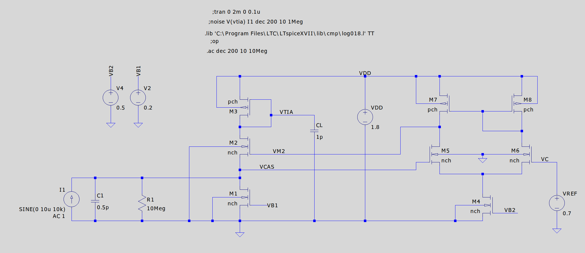
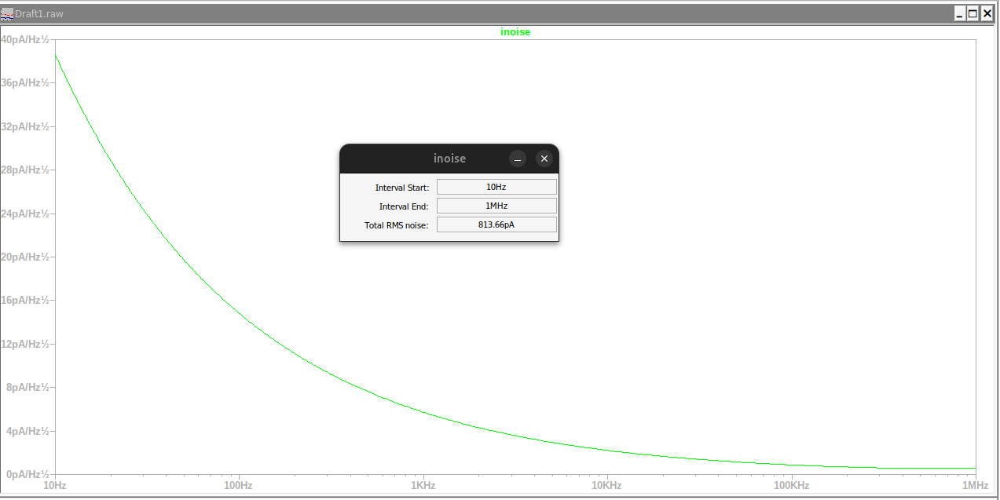

# EE4C10 Analog Circuit Design Fundamentals

LTspice-based coursework for EE4C10 at TU Delft on a 180 nm CMOS process (`log018.l` models). The repository runs the full course: weekly LTspice practicals, graded homework assignments, two track-specific design assignments, and the reference material collected for the final exam. Everything is built and simulated in LTspice, with submitted reports as PDFs.

## Bioelectronics track assignment: neural-recording front-end

The flagship design is a current-conveyor transimpedance amplifier for neural recording (`bioelectronics_assignment/`): a low-noise front-end that senses a small AC current on a high input impedance and converts it to voltage, with a gain-boosted cascode variant to raise the transimpedance while keeping input-referred noise low.

The analysis covers the DC operating point and transistor sizing, input impedance at the sense node, transient response to a 10 kHz sinusoidal input current, and input-referred current noise from an AC noise sweep.

## CMOS references assignment

`references_assignment/` and `finals/reference/` build a CMOS bandgap voltage reference step by step: CTAT and PTAT branches from BJTs, the combined bandgap, noise, and a chopper-stabilized amplifier version, following the single-trim bandgap reference paper included as reference.

## Homework and practicals

- `assignments/hw1/` to `hw5/`: graded LTspice exercises on single-stage amplifiers, current mirrors, differential pairs (common-mode and differential-mode analysis), and feedback.
- `practicals/week1/` to `week6/`: guided weekly LTspice sessions ending in energy-harvesting power management (`week6`, with the reference papers).
- `tutorial/`: the LTspice intro tutorial and 180 nm model setup.

## Final exam preparation

`finals/` gathers the track material and reference papers used to prepare for the exam: bioelectronics (Harrison, Manickam), power management / energy harvesting (Sijun Du, Ramadass, Aktakka), RF (LNA with shunt feedback), and CMOS references (bandgap hands-on).

## Repository layout

| Path | Contents |
| --- | --- |
| `bioelectronics_assignment/` | Neural-recording TIA design, schematics, sims, report |
| `references_assignment/` | CMOS bandgap reference design and report |
| `assignments/` | Graded homework LTspice decks (hw1 to hw5) |
| `practicals/` | Weekly LTspice practical sessions (week1 to week6) |
| `finals/` | Exam reference material by track |
| `tutorial/` | LTspice tutorial and model library |

Tools: LTspice XVII with the 180 nm BSIM3 model library, MATLAB for a few homework calculations.
